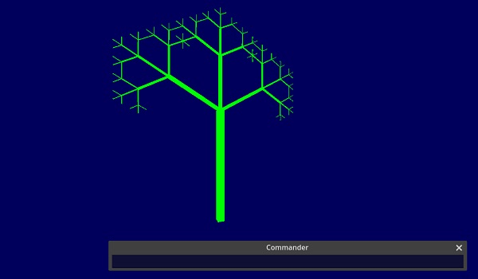
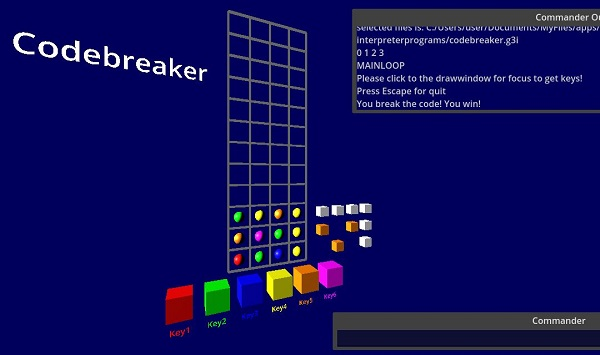

# Godot3DInterpreter - new version 0.CallDeferred     

a lowlevel logo-like interpreter to produce 3D-graphics with Godot. but instead of good old Logo the turtle (the graphiccursor) now hovers in 3D-space, the cyberspace.    
written in C# with Godot 4.1, also tested with 4.2devsnapshot              

example interpreterprogram procedure with PENSIZE 3:    

     
example interpreterprogram recursive tree:    


example interpreterprogram codebreaker.g3i - a game in the interpreter (some call it mastermind):    
the game has a secret code of four colors. You can guess it. colors are shown below. Red = key1, Green = key 2 and so on.   
after you guess 4 colors the game shows on the right the results - white box for correct position, orange box for wrong position. if you guess all four colors at right position, you win. you have 12 tries.    
in the pic you see my try, i first guess red green blue yellow (typed keys 1,2,3,4) and the result ...        


    
# Welcome back commander:    
when you start you see the commander below - a one line TextEditor. and in the top left corner the output window of the commander. in the middle of the screen you see the "turtle", the 3D-cursor that shows to the direction, you will draw.   

if you enter in the commander for example   
```
PRINT "[hello world]    
```
and the string is printed to output.    

or you type:    
```
FORWARD 30
```
and enter with Return, you see the turtle moves and draws a line - a 3D-line of MeshInstance3D. Then enter   
```
LEFT 90
```
and again FORWARD 30 and you see the next line. If you enter for example:   
```
REPEAT 4 [ FORWARD 30 LEFT 90 ]   
```
you get a square. you can move camera3D with keys WASD and arrowkeys.       

You can write a procedure if you type
```
TO "X :N   PRINT :N  END    
```
and can call it from the commander with 
```
GO "X 42
```
and the procedure will write 42 to output.

If you want interpreterprograms, type LOAD and you can load one of the example-programs in the interpreterprograms-directory. You can write with your editor of your choice others and load them with load.   
   

  
# Commands commander:   
arrow-up pressed in commander repeats last commands    
LOAD - If you want interpreterprograms, type LOAD and you can load one of the example-programs in the interpreterprograms-directory. You can write with your editor others and load them with load.   
PRINTOUT string - prints a procedure or with "ALL it prints all procedures.    
ERASE string - erases a procedure or with "ALL it erases all procedures.    
HELP - print helpmessages   
QUIT - quit program    

   
    
   
# Commands 3D:   
camera3D movement with Keys WASD, Arrowkeys   
FORWARD number - draw a line forward    
BACK number   
LEFT number - change left in degrees   
RIGHT number   
UP number (cause we are in 3D)   
DOWN number (cause we are in 3D)   
PENUP    
PENDOWN    
PENSIZE number - thickness of 3d lines, normal is 1. now the lines are thin boxes MeshInstance3D.    
HOME   
CLEAN - clear all       
PENCOLOR number number number - the numbers should be 0-255, also you can type RANDOM then a random number is generated     
BACKGROUND number number number - backgroundcolor, the numbers should be 0-255, also you can type RANDOM then a random number is generated     
CAMERA number number number - move the camera relativ, CAMERA 0 0 100 moves the camera +100 Z, look for example interpreterprogram  procedure.g3i        
MESH meshnamestring number - draws a mesh (godot MeshInstance3D) with size n, example MESH "SPHERE 30    
   possible meshes are SPHERE, BOX, TORUS, CAPSULE, CYLINDER, PLANE, QUAD, PRISM    
   uses the color set with PENCOLOR and is printed at position and rotated like the turtle    
PRINTTD string size - print three dimensional, it uses Godot Label3D, for example PRINTTD "Helloworld 1000    
   PRINTTD uses the color set with PENCOLOR and is printed at position and rotated like the turtle, if you rotate turte 45 - the text is 45 rotated    
   see example codebreaker.g3i     
   

   
# Commands interpreter "language": 
7 - a number, -7 is a minus seven        
0.7 - a floatnumber   
; xxx - a comment   
"X - a string   
"[xx xx] - a string with spaces, for example "[hello world], its a list of words   
MAKE "variablename number/string - declare a variable, NO GLOBAL variables, warning: you have to declare a variable, except a variable in procedureparameters    
get the value with :variablename, change with MAKE "varname = ... example:   
```
   MAKE "X 7    
   PRINT :X   
   MAKE "X = :X + 7    
```
PRINT string - print more separated with COMMA, examples: PRINT "hello or PRINT :X    
REPEAT number [ xxx ] - repeat something example: 
```
   REPEAT 4 
   [ 
      FORWARD 30
      LEFT 90 
   ]
```
FOR varname number number number [ xxx ] - for loop, example: 
```
   FOR "I 1 3 1    
   [     
      PRINT :I     
   ]      
```
WHILE expression [ dosomething ] - works til expression greater 0 - example:    
```
   MAKE "X 0    
   WHILE :X < 7     
   [     
      MAKE "X = :X + 1     
      PRINT :X    
   ]
```
     
IF condition dosomething ENDIF - if command with EQUAL = NOTEQUAL <> LESS < GREATER >, example IF :N > 7 PRINT :N ENDIF       
TO procedurename xxx formalparameters END - a procedure, parameter allowed ( recursion now works, see example ), example TO "PROC :A PRINT :A END    
GO procedurename arguments - start a procedure, parameter allowed, NO nested procedures(proc in proc), example GO "PROC 42. for recursion the STOP-command now works, see example treewithstopcommand.g3i             
RANDOM as parameter, if RANDOM alone means 0-255, or RANDOM n for number, for example FORWARD RANDOM 50 means forward 0-49   
math with */+- and parenthesis () behind a = EQUALS TOKEN. for floatnumbers use dot as comma. or behind procedureparamtervariable example: MAKE "X 0  "X = :X + 7  PRINT :X, now also with float. or math in procedureparameter example: 
```
   TO "PROC :N   
      PRINT :N   
   END
```
   ->call-> 
```
   MAKE "A 2
   GO "PROC :A + 1
```
   see also example recursiontest             
SLEEP number - sleep n milliseconds (see example procedure.g3i)   
GETKEY - input command, get the key as string. example MAKE "A "KEY WHILE 1=1 [ PRINT GETKEY ] or get in variable    
```
   MAKE "K "A    
   WHILE :K <> "Escape    
   [    
      MAKE "K = GETKEY    
      IF :K = "Key1    
         PRINT "Found_Key1     
      ENDIF    
   ]    
```
   the focus must be in the drawingwindow (click with mouse)    
ITEM - get an item of a list    
    example print item:  
```
    MAKE "B "[ONE TWO THREE]  
    PRINT ITEM 1 :B ; prints TWO    
```

example get item: 

```
    MAKE "B "[ONE TWO THREE]  
    MAKE "A = ITEM 0 :B ;gets the first item of list "B in this case variable "A is set to ONE    
```
SETITEM - set an item of a list    
    example set item: 
```
    MAKE "B "[ONE TWO THREE] 
    MAKE "B = SETITEM 1 "TEST
    PRINT :B ; prints ONE TEST THREE   
```
COUNT - get length of words in a list, example "X = COUNT :A    
      
      
  
# Last changes:    
- start parser as thread, now changing scene is possible. new command SLEEP, see example lasershow.g3i.      
- added a window for commanderoutput, repeat last command with arrow-up in commander and a semanticanalyser at start checking undeclared variables      
- WHILE command that works til expression greater 0, GETKEY command and Lists, commands ITEM, SETITEM, COUNT     
- new Token NOTEQUAL <> , change command MAKE - variabledeclaration with MAKE "varname value, change with MAKE "varname = ...     
- new example interpreterprogram codebreaker.g3i, see picture, new command PRINTTD
- for godotversion 4.1 up changed threadcalls to CallDeferred
- the commander knows more old commands - get them back with UP arrow key            


# the program
it works like an old steam machine. Full of bugs and chaos in the code.               
Its based on a good tutorial https://strongminds.dk/artikler/writing-a-small-parser-interpreter-part-1-scanner/   
and from this very good tutorial https://ruslanspivak.com/lsbasi-part18/ i changed the variable system to AR and stack, procedures with parameter and recursion now work.     
   

# contact:
sys_temerror at web dot de    

  
