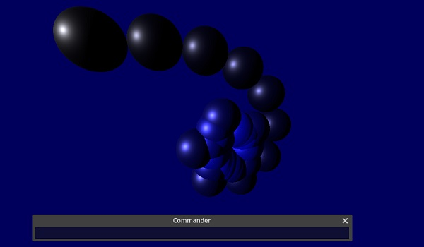

# Godot3DInterpreter

WIP - work in progress

a lowlevel logo-like interpreter to produce 3D-graphics with Godot.    
Working like an old steammachine, that rattles and steams. dont look to the code - some parts are chaos, spaghetti and bugs.         
Its based on a tutorial https://strongminds.dk/artikler/writing-a-small-parser-interpreter-part-1-scanner/   
and from this tutorial https://ruslanspivak.com/lsbasi-part18/ i changed the variable system to AR and stack, procedures with parameter now work. cause the tutorial does not contain recursion, i had to write own, now it works - a great milestone! see recursiontest.g3i    

- written in C# with Godot 4.0 rc3   

example interpreterprogram procedure with PENSIZE 3:    

   
example interpreterprogram spheres:    

    
     
example interpreterprogram recursiontest:    

    
when you start you see the commander - a one line TextEditor. if you enter for example   
PRINT "[hello world]    
and the string is printed to GODOT-output.    

or you type:    
FORWARD 30    
and enter with Return, you see a 3D-line of MeshInstance3D. Then enter   
LEFT 90   
and again FORWARD 30 and you see the next line. If you enter for example:   
REPEAT 4 [ FORWARD 30 LEFT 90 ]   
you get a Cube.   

You can write a procedure if you type TO "X :N   PRINT :N   END    
and can call it with GO "X 42
and the procedure will write 42 to Godot-output.

If you like to programs, type LOAD and you can load one of the example-programs in the interpreterprograms-directory. You can write with your editor others and load them with load.   
     
    
   
# Commands 3D (lowercase allowed):   
camera3D movement with Keys WASD, Arrowkeys   
FORWARD number - draw a line forward    
BACK number   
LEFT number - change left in degrees   
RIGHT number   
UP number (cause we are in 3D)   
DOWN number (cause we are in 3D)   
PENUP    
PENDOWN
PENSIZE number - thickness of 3d lines, normal is 1. now the lines are thin boxes MeshInstance3D.    
HOME   
CLEAN - clear the 3D-lines   
PENCOLOR number number number - the numbers should be 0-255, also you can type RANDOM then a random number is generated    
SPHERE number - draws a sphere (godot MeshInstance3D)   
BOX number - draws a box (godot MeshInstance3D)

   
# Commands interpreter "language" (lowercase allowed):   
; xxx - a comment   
"X - a string   
"[xx xx] - a string with spaces, for example "[hello world]   
MAKE "variablename number - declare a variable get the value with :variablename, change with "X = 7, exampe: MAKE "X 7    PRINT :X   
PRINT string - print   
REPEAT number [ xxx ] - repeat something example: REPEAT 4 [ FORWARD 30 LEFT 90 ]   
FOR varname number number number [ xxx ] - for loop, example: FOR "I 1 3 1 [ PRINT :I ]   
IF xxx ENDIF - if command   
TO procedurename xxx END - a procedure, parameter allowed ( recursion now works, see example ), example TO "PROC :A PRINT :A END    
GO procedurename - start a procedure, parameter allowed, example GO "PROC 42     
RANDOM as parameter, if RANDOM alone means 0-255, or RANDOM n for number, for example FORWARD RANDOM 50 means forward 0-49   
math with */+- and parenthesis () behind a = EQUALS TOKEN. or behind procedureparamtervariable example: MAKE "X 0  "X = :X + 7  PRINT :X, now also with float. or math in procedureparameter example: TO "PROC :N   PRINT :N   END ->call-> MAKE "A 2   GO "PROC :A + 1, see also example recursiontest           
      
         
         
# FAQ:   
- why an interpreter, we have gdscript and other languages? for fun and learning c# with godot 4     
- want contact? send me message in godot-forum. you have a nice interpreterprogram with nice results, then please send me?     
  
    
# last changes:  
  23.02.2023: new variablesystem with AR and stack (good tutorial https://ruslanspivak.com/lsbasi-part18/), parameter work, AR/stack working    
  24.02.2023: added command PENSIZE for 3d lines, they are now thin boxes, thx to Calinou's tips in internet. changed command SETPENCOLOR to PENCOLOR. moved to Godot 4.0 RC4    
  25.02.2023: moved to Godot 4.0 RC5, now recursion works, see example recursiontest.g3i, also numbers with dot works also in that example     
  26.02.2023: added math in procedureparameter example GO "PROC :N * 0.7, see example recursiontest.g3i    
  
  
