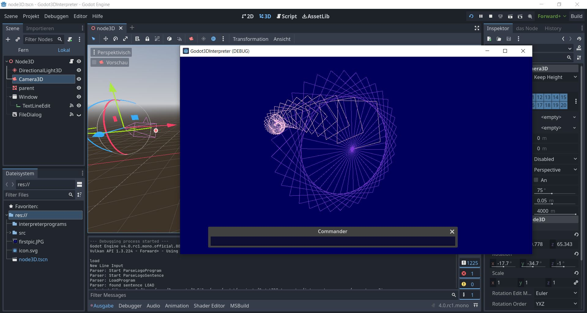

# Godot3DInterpreter

WIP - work in progress

a little logo-like interpreter, very buggy, but working (working like an old steammachine, that rattles and steams).   
its based on a tutorial https://strongminds.dk/artikler/writing-a-small-parser-interpreter-part-1-scanner/  

- written in C# with Godot 4.0 rc1   

when you start you see the commander - a one line TextEditor. if you enter for example   
PRINT "[hello world]    
and the string is printed to GODOT-output. or you type:    
FORWARD 30    
and enter with Return, you see a 3D-line of MeshInstance3D. Then enter   
LEFT 90   
and again FORWARD 30 and you see the next line. If you enter for example:   
REPEAT 4 [ FORWARD 30 LEFT 90 ]   
you get a Cube.   
If you like to get real programs, type   
LOAD   
and you can load one of the example-programs in the interpreterprograms-directory. You can write with your editor others and load them with load.   
    
   
# Commands 3D (lowercase allowed):   
FORWARD number - draw a line forward   
BACK number   
LEFT number - change left in degrees   
RIGHT number   
UP number (cause we are in 3D)   
DOWN number (cause we are in 3D)   
PENUP    
PENDOWN   
HOME   
CLEAN - clear the 3D-lines   
SETPENCOLOR number number number - the numbers should be 0-255, also you can type RANDOM then a random number is generated   

# Commands interpreter "language" (lowercase allowed):   
; xxx - a comment   
"X - a string   
"[xx xx] - a string with spaces, for example "[hello world]   
MAKE "variablename number - declare a variable get the value with :variablename, exampe: MAKE "X 7    PRINT :X   
PRINT string - print   
REPEAT number [ xxx ] - repeat something example: REPEAT 4 [ FORWARD 30 LEFT 90 ]   
FOR varname number number number [ xxx ] - for loop, example: FOR "I 1 3 1 [ PRINT :I ]   
IF xxx ENDIF - if command   
TO procedurename xxx END - a procedure !working with parameter still buggy!crash!WIP  
GO procedurename - start a procedure   
   
     
   
      
# FAQ:   
- why an interpreter, we have gdscript and other languages?   
  for fun and learning c# with godot 4     
  
    
    
    
    
# changes:
18.02.2023: now declare procedure in commander works - example type TO "TEST PRINT "TESTING END and then return. then type GO "TEST   
18.02.2023: added a meshinstance3D-sphere as turtle
19.02.2023: added camera3d movement with WASD, ArrowUp/Down
 

